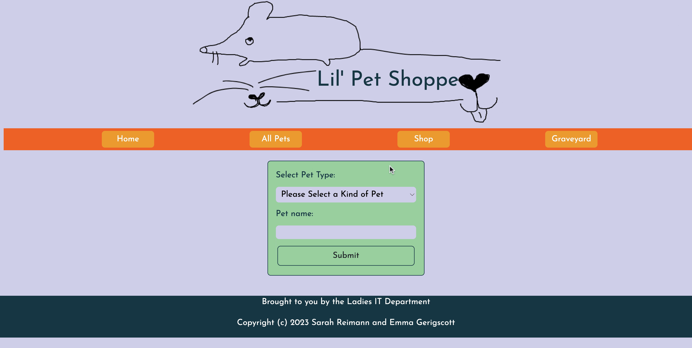

# Lil' Pet Shoppe

### By Emma Gerigscott



## Description

Create a pet that you can pet, play, and feed! Name your pet and add it to your collection. Don't forget to take care of your pet, as it becomes hungry and lonely over time!

## Technologies Used

* C#
* .NET
* ASP.NET Core
* MVC
* Microsoft Tests

## Setup Instructions

1. Clone this repo.
2. Open your terminal (e.g. Terminal or GitBash) and navigate to this project's directory called "Tamagotchi".
3. To compile and view the webpage, in the command line in the directory "Tamagotchi", run:
```
$ dotnet watch run
```
4. Optionally, you can run "dotnet build" to compile this webpage without running it.
5. If the webpage does not auto-load, go to your browser and navigate to https://localhost:5001
6. When prompted, enter your computers password to allow ASP.NET Core to run in your browser.
7. If you'd like to run tests, navigate to the Tamagotchi.Tests directory in your command line.
8. To run tests, in your command line from Tamagotchi.Solution/Tamagotchi.Tests, run:
```
$ dotnet test
```

## Known Bugs

* _Logo is fixed position_
* _Ids for pets throws off delete and edit functionality_
* _Methods for feeding, sleeping, and playing do not increment correctly_
* _Pets don't actually die yet_

## License
[MIT](https://opensource.org/licenses/MIT)  
Copyright © 2023 Emma Gerigscott, Sarah Reimann -- Ladies IT Department
